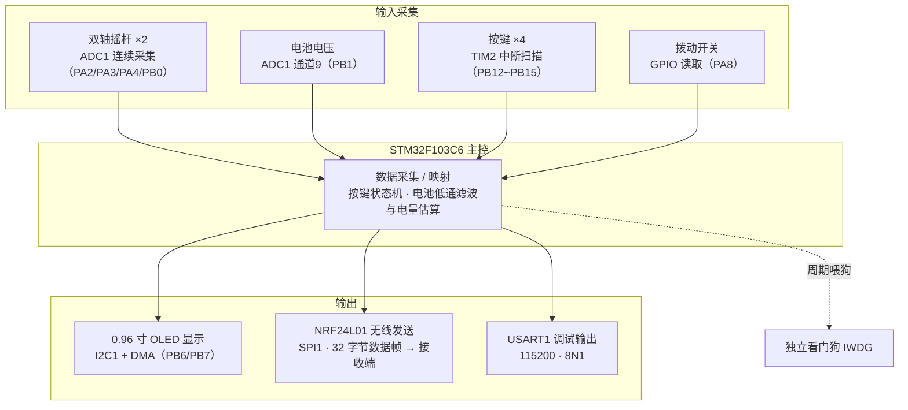

# SimpleRemote

SimpleRemote 是一套基于 STM32F103 的简易无线遥控器工程。遥控器采集摇杆、按键、拨动开关和电池电压，在 OLED 上显示当前状态，并通过 NRF24L01 将控制数据发送给接收端。

## 功能架构



## 主要功能

- 采集 4 路模拟摇杆或电位器输入。
- 识别 4 个独立按键的单击、双击和长按操作。
- 读取 1 个双向拨动开关状态。
- 检测锂电池电压并估算剩余电量。
- 在 0.96 英寸 OLED 上显示摇杆方向、按键、开关和电量状态。
- 使用 NRF24L01 发送固定长度的 32 字节遥控数据帧。
- 通过 USART1 输出初始化信息和无线发送数据，便于调试。
- 使用独立看门狗提升程序异常后的自动恢复能力。

## 主控芯片

- MCU：STM32F103C6，ARM Cortex-M3 内核。
- 系统时钟：外部 8 MHz 晶振，经 PLL 倍频至 72 MHz。
- 开发方式：裸机主循环，无 RTOS。
- 外设库：STM32F10x Standard Peripheral Library V3.5.0。

当前 Keil 工程目标配置为 `STM32F103C6`，Flash 和 RAM 分别按 32 KB、10 KB 配置。工程文件名为 `stm32f103c8t6.uvprojx`，如果实际硬件使用 STM32F103C8，应在 Keil 中再次核对目标器件和存储空间配置。

## 主要元器件

| 元器件 | 用途 |
| --- | --- |
| STM32F103C6T6A | 主控制器，负责输入采集、显示和无线通信 |
| E01-ML01DP5 | 基于 NRF24L01+ 的 2.4 GHz PA 大功率无线模块 |
| 0.96 英寸 OLED | 128×64 SSD1306 显示模组，通过四针 I2C 接口连接 |
| 3D161 摇杆 ×2 | 提供 4 路模拟控制量，由 ADC1 和 DMA 连续采集 |
| K2-1817UQ-C4SW-01 ×4 | 提供单击、双击和长按控制输入 |
| IP2312U | USB-C 输入侧的单节锂电池充电/电源管理 |
| FP6291LR-G12 | 将电池电压升压至系统输出电压 |
| RT9013-33GB-MS ×2 | 分别产生主系统 3V3 和无线模块 NRF24_3V3 |
| 8 MHz 晶振 | STM32 外部高速时钟源 |

## 主要接口

| 功能 | STM32 引脚 |
| --- | --- |
| 摇杆/电位器 ADC | PA2、PA3、PA4、PB0 |
| 电池电压 ADC | PB1 |
| 按键 1～4 | PB12～PB15，低电平按下，硬件外部上拉 |
| 拨动开关 | PA8 |
| OLED I2C1 | PB6/SCL、PB7/SDA |
| NRF24L01 SPI1 | PA5/SCK、PA6/MISO、PA7/MOSI |
| NRF24L01 控制信号 | PB8/CE、PB9/CSN、PA15/IRQ |
| USART1 调试串口 | PA9/TX、PA10/RX，115200 baud、8N1 |

## 目录结构

```text
SimpleRemote/
├─ README.md                 工程说明
├─ scripts/                  设计与校核过程中使用的自动化脚本源码
│  ├─ README.md              脚本用途和运行环境说明
│  └─ mechanical/            SolidWorks C# 与 STEP 分析脚本
├─ hardware/
│  ├─ electronics/           嘉立创 EDA 工程、原理图 PDF、PCB 网表和硬件分析
│  └─ mechanical/            遥控器机械结构和装配模型
└─ mcu/                      STM32 固件工程
   ├─ Code/                  按键、OLED、I2C、ADC、NRF24 等功能模块
   ├─ User/                  main.c 和中断服务函数
   ├─ Library/               STM32F10x 标准外设库
   ├─ start/                 CMSIS、系统时钟和启动文件
   └─ stm32f103c8t6.uvprojx  Keil MDK 工程文件
```

## 软件工作流程

上电后，程序依次初始化 72 MHz 系统时钟、SysTick、独立看门狗、串口、按键定时器、ADC DMA、OLED 和 NRF24L01。主循环持续执行以下操作：

1. 将 ADC 数据转换为摇杆控制量并更新 OLED 显示缓冲区。
2. 对电池 ADC 值进行低通滤波，计算电池电压和百分比。
3. 组合摇杆、按键、拨动开关和电池信息。
4. 通过 NRF24L01 发送 32 字节数据帧。
5. 从 USART1 输出发送内容并喂独立看门狗。

按键由 TIM2 周期中断扫描，OLED 全屏数据通过 I2C1 TX 对应的 DMA1 Channel 6 异步发送。

## 开发与编译

- IDE：Keil MDK-ARM / μVision 5（本机路径 `D:\SoftWare\stm32Keil`，μVision V5.38）。
- 编译器：ARM Compiler 5（V5.06 update 7）。
- 工程入口：`mcu/stm32f103c8t6.uvprojx`，输出名为 `stm32f103c8t6`。
- 固件入口：`mcu/User/main.c`。
- Keil 生成的 `Objects/`、`Listings/`、`DebugConfig/` 和用户界面配置不纳入 Git。
- 源码编码已统一为 UTF-8（无 BOM），含中文注释的 .c/.h 均为 UTF-8，可直接用现代编辑器打开。

最近一次完整编译（2026-08-16，命令行 `UV4 -b`）：**0 Error(s), 0 Warning(s)**。链接结果：ROM 25.07 kB / 32 kB（约 78%），RAM 3.80 kB / 10 kB（约 38%）。产物为 `mcu/Objects/stm32f103c8t6.axf` 与 `stm32f103c8t6.hex`。

工程由其他位置迁移而来。首次打开 Keil 工程时，应核对目标芯片、Pack 版本、ST-Link 下载配置以及实际硬件接线。

电子设计源文件位于 `hardware/electronics/`。当前为 2026-08-15 导出的最新版本：`ReuseBlock_遥控器1.0_2026-08-15.epro`（嘉立创 EDA 工程）、`SCH_Schematic1_2026-08-15.pdf`（原理图）和 `遥控器1.0网表.tel`（PCB 网表，实测 86 个元件位号、70 个网络），电源结构、器件和 MCU 引脚对应的详细分析见该目录 README。
