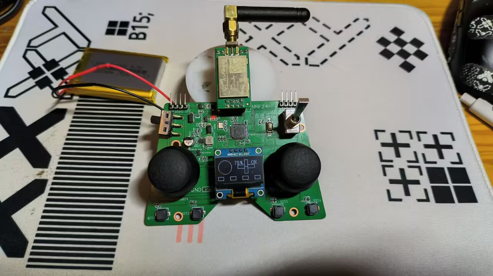
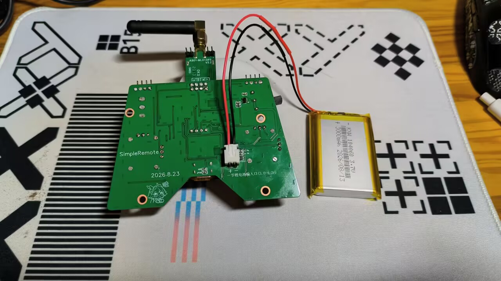
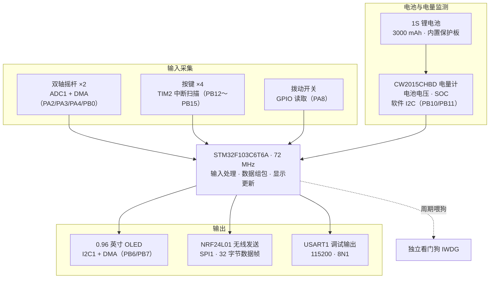
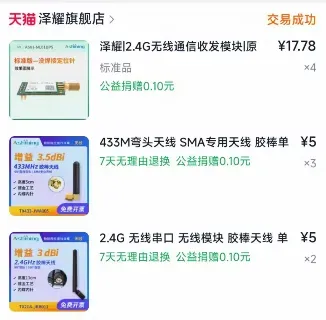
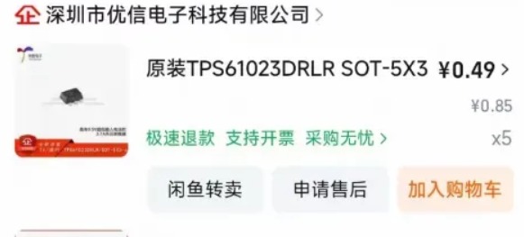
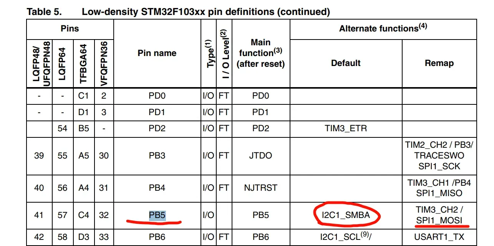

# SimpleRemote

## 项目介绍

SimpleRemote 是基于 STM32F103C6T6A 设计的一款小型无线遥控器，集成双摇杆、四个按键、拨动开关、OLED 屏幕和锂电池充电电路。遥控器通过 NRF24L01 发送摇杆、按键、开关和电池电压数据，通过 CW2015CHBD 获取电池电量并显示在屏幕上。

尽量保持代码模块化，并为主要逻辑添加中文注释，方便理解和二次开发。屏幕界面由我结合 AI 辅助和手写绘图函数实现。

- Git项目仓库：[CherdonFlash/SimpleRemote](https://github.com/CherdonFlash/SimpleRemote)
- 联系 QQ：1228879785

## 项目图片





## 功能架构



## 主要功能

| 模块 | 功能 | 主要源码 |
| --- | --- | --- |
| 双摇杆 | ADC1 四通道连续采样，DMA 循环搬运，映射为四路有符号控制量 | [mobile.c](mcu/Code/mobile.c) |
| 按键 | 四个按键周期扫描、消抖，非阻塞状态机识别单击、双击和长按 | [key.c](mcu/Code/key.c) |
| 拨动开关 | 读取开关档位，参与显示和无线组包 | [turn.c](mcu/Code/turn.c) |
| OLED | 128×64 帧缓冲绘图，硬件 I2C＋DMA 全屏刷新，显示摇杆、按键、开关和电量状态 | [app_display.c](mcu/Code/app_display.c)、[oled096.c](mcu/Code/oled096.c)、[iic.c](mcu/Code/iic.c) |
| 无线发送 | 硬件 SPI1 驱动 NRF24L01，发送 32 字节控制数据，启用自动应答和自动重发 | [nrf24.c](mcu/Code/nrf24.c) |
| 电量监测 | PB10/PB11 开漏 GPIO 模拟 I2C，每秒读取电池数据，更新屏幕电量百分比 | [cw2015.c](mcu/Code/cw2015.c)、[bat.c](mcu/Code/bat.c) |
| 串口 | USART1 输出初始化信息和发送数据；支持格式化输出，采用阻塞发送 | [uart.c](mcu/Code/uart.c) |
| 看门狗 | 主循环定期喂独立看门狗，异常时自动复位 | [main.c](mcu/User/main.c) |

### 无线数据帧

无线载荷固定为 32 字节，组包逻辑位于 [NRF_SendAll()](mcu/Code/nrf24.c)。

| 字节偏移（从 0 开始） | 内容 | 编码 |
| --- | --- | --- |
| 0 | 帧头 | `0x51` |
| 1～4 | 四路摇杆控制量 | 每路 `int8_t`，范围 −128～127，以 8 位补码传输 |
| 5 | 四个按键的按住状态 | bit0～bit3 对应按键 1～4，1 表示按住；bit4～bit7 为 0 |
| 6 | 拨动开关 | `turn_get()` 返回的 0/1 |
| 7～8 | 电池电压 | 单位 mV，7 为高字节，8 为低字节 |
| 9～30 | 预留 | 0 |
| 31 | 帧尾 | `0x15` |

按键字段使用消抖后的持续按住状态。无线芯片启用 2 字节 CRC，帧头和帧尾用于标识业务数据格式。

## 主控与主要元器件

主控采用 STM32F103C6T6A，Cortex-M3 内核，外部 8 MHz 晶振经 PLL 倍频至 72 MHz。程序采用裸机主循环，使用 STM32F10x 标准外设库 V3.5.0，Keil 工程按 32 KB Flash、10 KB RAM 配置。

STM32F103C6 具有一路硬件 I2C 和一路 SPI：OLED 使用 I2C1，无线模块使用 SPI1，电量计使用独立的软件 I2C。器件资料见 [ST 官方页面](https://www.st.com/en/microcontrollers-microprocessors/stm32f103c6.html)。

| 元器件 | 用途 |
| --- | --- |
| STM32F103C6T6A | 输入采集、显示和无线通信主控 |
| E01-ML01DP5 | 基于 NRF24L01+ 的 2.4 GHz PA 无线模块 |
| 0.96 英寸 OLED | 128×64 SSD1306 显示模组，四针 I2C 接口 |
| 3D161 摇杆 ×2 | 提供四路模拟控制量 |
| K2-1817UQ-C4SW-01 ×4 | 轻触按键输入 |
| CW2015CHBD | 单节锂电池电压与电量监测 |
| IP2312U | USB-C 输入的单节锂电池充电 |
| FP6291LR-G12 | 电池升压供电 |
| RT9013-33GB-MS ×2 | 分别产生主系统 3V3 和无线模块 NRF24_3V3 |
| 8 MHz 晶振 | MCU 外部高速时钟源 |

## 接口定义

| 功能 | STM32 引脚 |
| --- | --- |
| 摇杆 ADC | PA2、PA3、PA4、PB0 |
| 电量计软件 I2C | PB10/SCL、PB11/SDA |
| 按键 1～4 | PB12～PB15，外部上拉，低电平按下 |
| 拨动开关 | PA8 |
| OLED I2C1 | PB6/SCL、PB7/SDA |
| NRF24L01 SPI1 | PA5/SCK、PA6/MISO、PA7/MOSI |
| NRF24L01 控制 | PB8/CE、PB9/CSN、PA15/IRQ |
| USART1 | PA9/TX、PA10/RX，115200 baud、8N1 |

## 性能、功耗与续航

以下整理了我的电流测量记录、固件运行统计和理论估算。估算使用 3000 mAh 标称容量，并假设记录的电流为电池端整机平均电流；实际续航受电池容量、温度、老化和工作状态影响。

### 电池与功耗

| 项目 | 参数 / 数据 | 说明 |
| --- | --- | --- |
| 电池 | 1S 聚合物软包锂电池，3000 mAh | 内置保护板，支持 3 A 充电 |
| 关机静态电流 | **32.7 μA** | 实测整机关机电流 |
| 开机运行电流 | **54 mA** | 实测运行电流，随供电电压和工作状态变化 |
| 关机耗电量 | 约 0.785 mAh/天、23.54 mAh/30 天 | 按 32.7 μA 计算，不含自放电 |

### 无线、屏幕与按键

| 项目 | 参数 / 数据 | 说明 |
| --- | --- | --- |
| 无线射频中心频率 | **2.400 GHz** | RF_CH＝0 |
| 无线空中数据速率 | **2 Mbps** | 射频配置值 |
| SPI1 时钟 | **9 MHz** | 72 MHz 八分频 |
| OLED I2C 时钟 | **400 kHz** | 硬件 I2C1，已通过 60.104 s 软件稳定性测试 |
| OLED 完整刷新率 | **约 19.65 FPS** | 400 kHz、关闭逐包日志，60.104 s 完成 1181 帧 |
| 按键扫描周期 | **10 ms** | TIM2 定时扫描，100 Hz |
| 按键消抖响应时间 | **约 10～20 ms** | 从输入稳定到软件确认的代码推算，不含机械抖动和硬件 RC 延迟 |
| 长按判定时间 | **500 ms** | 按键状态机计时参数 |
| 双击等待窗口 | **400 ms** | 按键状态机计时参数 |
| 电量计采集周期 | **1000 ms** | 首次立即读取，之后每秒更新 |

OLED 刷新率统计于 2026-09-13：历史基线为 300 kHz 总线且保留逐包串口日志，约 14.09 FPS；本次关闭逐包日志并将 I2C 提升到 400 kHz，60.104 s 完成 1181 帧，约 19.65 FPS。该数值表示完整帧传输完成速率，会随主循环负载变化。详细测试结果见[固件优化与调试记录](mcu/固件优化与调试记录_2026-09-13.md)，测量脚本为 [Measure-Runtime.ps1](scripts/firmware/Measure-Runtime.ps1)。

### 充电与续航估算

| 项目 | 估算结果 | 计算依据 |
| --- | --- | --- |
| 充电电流设定 | **约 2.65 A** | IP2312U 的 ICHG 电阻为 51 kΩ，135000/51000≈2.647 A，属于名义设定值 |
| 标称容量÷设定充电电流 | 约 1.13 小时（68 分钟） | 3000 mAh÷2647 mA，仅为全程恒流假设下的容量换算 |
| 满电持续开机续航 | **约 55.6 小时（2.31 天）** | 3000 mAh÷54 mA |
| 满电关机、仅静态负载耗尽容量 | 约 3823 天（10.47 年） | 3000 mAh÷0.0327 mA，忽略自放电、老化及低压截止损失 |
| 每天开机 1 小时、关机 23 小时 | 约 54.8 天 | 每日耗电约 54＋0.0327×23＝54.75 mAh |

充电采用恒流/恒压过程，**68 分钟不是实际充满时间**；恒压收尾、输入限流和温度都会影响充电时长。**10.47 年也不是安全存放或补电周期**，不能用它判断电池何时严重过放。上述时间均为估算，不能代替完整充放电及长期存放测量。

充电参数依据[原理图网表](hardware/electronics/新版遥控器V1.1.tel)和[英集芯 IP2312U 数据手册，第 6～7 页](https://datasheet.lcsc.com/datasheet/pdf/846feb3b6ab45044a5c29188d4a683e3.pdf?productCode=C605432)。

## 选购与装配

我在选型时主要考虑成本、焊接难度和复现便利性。采购时请结合[电子设计资料](hardware/electronics/README.md)核对型号、封装和尺寸。

| 部件 | 注意事项 |
| --- | --- |
| MCU | 核对 STM32F103C6T6A 的完整型号和封装 |
| 摇杆 ×2 | 我选用 5 kΩ 电位器摇杆，左侧双轴不回中，右侧单轴不回中；安装时核对脚位、轴高及回中方向，旋转 90° 会交换相对外壳的控制轴方向 |
| OLED | 选择 128×64、SSD1306 兼容、适用 3.3 V 的 I2C 模组；H1 的 1～4 脚为 GND、VCC、SCL、SDA，同时核对排针高度和屏板尺寸 |
| 按键 / 拨动开关 | 核对封装、脚距和高度；拨动开关还需确认公共端与两档的连通关系 |
| 无线模块 | 核对 E01-ML01DP5 的 8 针定义、供电和外形，装好匹配的 2.4 GHz 天线再正常发射 |
| 电池 | 使用支持板级充电电流、带保护板的 1S 锂电池，焊接前核对正负极 |
| 电源芯片 | 小封装焊接前确认定位标记和 1 脚；检查去耦电容、焊接质量和工作温升 |
| 串口 | 使用 3.3 V 逻辑电平 USB 转串口，TX/RX 交叉并共地 |

无线模块使用独立的 RT9013 稳压供电。E01-ML01DP5 在 20 dBm 发射条件下的典型电流约为 130 mA，电源设计需考虑发射瞬态，不能只按整机平均电流选型，参见[亿佰特官方参数](https://www.ebyte.com/product/7.html)。

### 选购图片参考

下面是我选购时保存的截图，方便查看器件外观和规格。下单时仍需核对上表中的型号、封装和尺寸，截图价格仅供参考。

主控芯片：


摇杆规格：装配需要两个摇杆，注意回中方式和安装方向。选用360度回中5K。（也可以按照你的方式来选不回中）


拨动开关：


无线模块：图片用于外观参考，采购型号和引脚定义按 E01-ML01DP5 核对。



电源配件：dcdc芯片可以在优信电子买。电池我买的3000mah，容量随意，但是注意尺寸。




这些都是主要的元器件，剩下部分元器件不过多展开描述，对比PCB查看缺少的元器件购买就行，需要注意电容的耐压就行了。

电池接口是XH2.54-2P弯针类型，在优信电子有，对应的接口线也在优信电子有（不要忘记买接口线，可以焊接到电池两端）。

### 外壳

工程包含底壳、上壳、STEP/STL 文件和 SolidWorks 装配体，详见[机械设计说明](hardware/mechanical/README.md)。

- USB-C 在侧壁开口，方便插拔供电线。
- 左侧电源开关槽覆盖开、关两个拨动位置。
- OLED 从排针向 Type-C 方向延伸。
- 摇杆孔和 NRF24 开口按 PCB 三维模型定位。

打印或加工前，请结合装配实物核对孔位、器件高度、电池空间和插头插拔余量。

## 软件工作流程

我将初始化和主循环任务编排集中在 `main.c`，将屏幕布局放在 `app_display.c`，各外设驱动独立存放在 `mcu/Code/`。

上电完成时钟、看门狗和外设初始化后，主循环执行：

1. 处理 OLED DMA 完成状态、总线收尾和传输超时。
2. 每秒读取电量计，更新电池电压和电量百分比。
3. 更新四路摇杆控制量。
4. 组合摇杆、按键按住状态、拨动开关和电压，发送无线数据；逐包串口日志默认关闭，可通过编译开关临时启用。
5. 更新屏幕内容，显示异常时周期性尝试恢复。
6. 喂独立看门狗。

按键在 TIM2 中断中每 10 ms 扫描。`Key_IsPressed()` 获取消抖后的按住状态，`Key_TakeEvents()` 读取并清除单击、双击和长按事件；双击过程中会先产生单击事件，再产生双击事件。

OLED 全屏数据通过 DMA1 Channel 6 异步发送，主循环确认 BTF 和 STOP 收尾完成后释放传输状态。电量计无有效电量读数时显示“--%”，读取失败时保留最后有效电压。SOC 为芯片估算值，精度取决于电池曲线匹配与标定。

## 开发经验

### SPI 通信

调试 SPI 时，我主要结合数据手册和逻辑分析仪检查以下内容：

- 核对 CPOL/CPHA、位序、时钟频率、命令格式和片选有效电平。
- SPI 每发送一个字节，也同步接收一个字节；读取数据时需要继续发送 dummy 字节以提供时钟，具体数量按器件协议确定。
- NRF24 的命令阶段返回 STATUS，后续字节才是寄存器数据；单字节命令由 `NRF_Write_Cmd()` 处理。
- NRF24 的 CSN 低有效、空闲为高，CE 用于控制收发状态，两者不要混淆。
- 同时观察 CSN、SCK、MOSI 和 MISO 波形，按字节定位问题，并检查供电及上电时序。

### PB5 复用限制

我在调试中遇到过 SPI1 重映射到 PB3/PB4/PB5 后，与 OLED 的 I2C1 无法同时正常工作的情况。ST 的 [ES0348 勘误 §2.3.4](https://www.st.com/resource/en/errata_sheet/es0348-stm32f101x46-stm32f102x46-stm32f103x46-device-errata-stmicroelectronics.pdf)说明：当 I2C1 和 SPI1 时钟都开启、SPI1 重映射并作为主机、PB5 配置为复用输出时，SPI1 MOSI 会与 I2C1 SMBA 冲突，即使没有使用 SMBA。

因此，我使用 PA5/PA6/PA7 的默认 SPI1 引脚连接 NRF24，PB6/PB7 的 I2C1 连接 OLED，避开这一组合。



## 目录结构

```text
SimpleRemote/
├─ README.md                 项目说明
├─ Git提交规范.md            中文约定式提交规范
├─ docs/
│  └─ readme-images/         README 项目图片及器件参考图片
├─ hardware/
│  ├─ electronics/           EDA 工程、原理图 PDF、网表和硬件说明
│  └─ mechanical/            外壳零件、交换文件和装配模型
├─ scripts/
│  ├─ firmware/              固件运行数据测量脚本
│  └─ mechanical/            SolidWorks 与 STEP 分析脚本
└─ mcu/
   ├─ Code/                  外设驱动与显示模块
   ├─ User/                  main.c 和中断服务函数
   ├─ Library/               STM32F10x 标准外设库
   ├─ start/                 CMSIS、系统时钟和启动文件
   └─ stm32f103c8t6.uvprojx  Keil 工程
```

## 开发与编译

- IDE：Keil MDK-ARM / μVision 5。
- 编译器：ARM Compiler 5，V5.06 update 7。
- 工程入口：[stm32f103c8t6.uvprojx](mcu/stm32f103c8t6.uvprojx)，目标器件配置为 STM32F103C6。
- 程序入口：[main.c](mcu/User/main.c)。
- 输出文件：`mcu/Objects/stm32f103c8t6.axf`、`stm32f103c8t6.hex`。
- 源码编码：UTF-8（无 BOM）。
- Git 提交遵循[Git提交规范.md](Git提交规范.md)，使用约定式提交格式和中文描述。

打开工程后，核对芯片配置、器件 Pack 和 ST-Link 下载设置，再编译下载。电子设计的工程文件、原理图和网表位于 [hardware/electronics](hardware/electronics/README.md)，机械文件位于 [hardware/mechanical](hardware/mechanical/README.md)。
