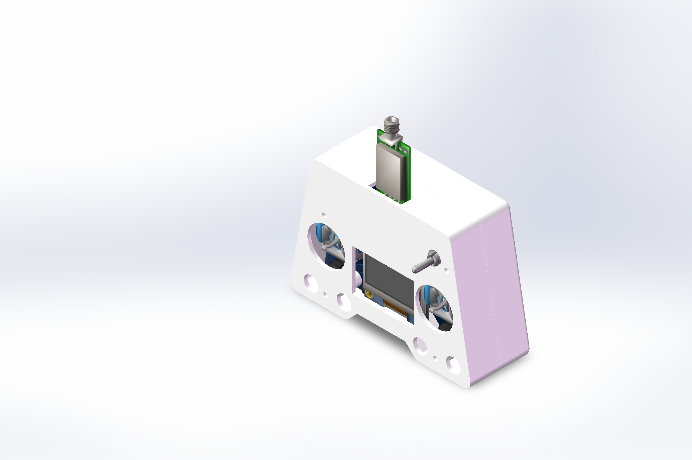

# SimpleRemote 机械外壳

本目录保存 PCB 三维参考、上下壳零件、SolidWorks 装配体和产品装配图。外壳依据 `3D_PCB1_2026-09-13.zip` 中的 OBJ/MTL 模型设计，通过 SolidWorks 2024 COM API 构建和导出，没有使用鼠标、键盘或桌面截图操作。

## 产品装配图



装配图由 SolidWorks 渲染 API 直接导出，分辨率为 2400 × 1600。图中包含上壳、底壳和 PCB 导出模型中的器件。

## 文件入口

| 文件 | 用途 |
| --- | --- |
| [遥控器产品装配体.SLDASM](遥控器产品装配体.SLDASM) | 产品装配入口，包含上下壳和 PCB |
| [遥控器新PCB校核装配体.SLDASM](遥控器新PCB校核装配体.SLDASM) | 同一套零件的对位校核装配体 |
| [遥控器外壳装配体.SLDASM](遥控器外壳装配体.SLDASM) | 仅包含上下壳 |
| `遥控器上壳.SLDPRT` / `.STEP` / `.STL` | 可编辑上壳、交换文件和打印网格 |
| `遥控器底壳.SLDPRT` / `.STEP` / `.STL` | 可编辑底壳、交换文件和打印网格 |
| [3D_PCB1_2026-09-13.zip](3D_PCB1_2026-09-13.zip) | PCB 三维导出原包 |
| [3D_PCB1_2026-09-13.SLDPRT](3D_PCB1_2026-09-13.SLDPRT) | OBJ 导入后的 SolidWorks 图形体 |
| [产品装配体_俯视图.png](产品装配体_俯视图.png) | 正面孔位与显示窗口 |
| [产品装配体_TypeC侧视图.png](产品装配体_TypeC侧视图.png) | USB 插拔凹口 |
| [产品装配体_电源开关侧视图.png](产品装配体_电源开关侧视图.png) | 电源开关侧槽 |
| [产品装配体_NRF24侧视图.png](产品装配体_NRF24侧视图.png) | 无线模块侧孔 |

打开装配体时，请保持这些零件位于同一目录。生成程序、分析程序和校核程序存放在 [scripts/mechanical](../../scripts/mechanical)。

## 设计参数

| 项目 | 参数与说明 |
| --- | --- |
| PCB 板框 | 约 98.263 × 66.650 mm，板厚约 1.600 mm |
| PCB 装配平移 | X＝−21.122147 mm，Y＝−41.820067 mm，Z＝17.600 mm |
| PCB 支承高度 | 底壳支柱顶面 Z＝16 mm，PCB 底面与支柱顶面对齐 |
| 上壳装配高度 | Z＝17.650 mm，接缝名义间隙约 0.05 mm |
| 外壳包络 | 约 102.264 × 70.650 × 34.850 mm，不含伸出的器件 |
| 上壳主体 | 高 17.2 mm，顶面和主要侧壁厚 2 mm，定位舌高 1.2 mm |
| OLED 模块 | 按确认的 35.4 × 33.5 mm 模型外形布置内腔，预留装配余量 |
| OLED 可视窗口 | 35.3 × 23.8 mm，按模型玻璃区域 34.5 × 23.0 mm 加每侧 0.4 mm；不是按整块屏板开通孔 |
| OLED 窗口位置 | 上壳 X＝12.155～47.455 mm，Y＝−29.185～−5.385 mm |
| 屏幕前伸罩 | 中部轮廓向 Type-C 方向前伸 8 mm，从上壳局部 Z＝7.5 mm 开始，下方保留 USB 插拔凹口 |
| USB-C 侧孔 | 总开口约 10.2 × 5.0 mm，跨上下壳接缝；底壳已补接口下半孔，俯视面不另开 USB 孔 |
| 电源开关侧槽 | 约 6.65 × 4.60 mm，覆盖拨柄及约 2.14 mm 两档行程；俯视面不开孔 |
| NRF24 侧孔 | 18.8 × 7.53 mm，按模块高度及 PCB 装配位置校准 |
| 摇杆孔 | 直径 21.5 mm；左右轴心分别为（−2.427，−13.356）和（59.041，−13.356）mm |
| 螺钉柱 | 柱位不变，底孔直径 2.5 mm；上壳两个后侧柱外径 5 mm，前侧柱外径 7 mm |
| 开关螺母避让 | 右后柱增加局部避让槽和通向侧壁的加强筋，减少螺母与柱体的空间冲突 |

PCB 原包 SHA-256：

```text
881F1B855C5F67EA5C6131750B5978CD39C77580C59CB4891DD092D3E48E4E53
```

## 校核记录

记录日期：2026-09-13。

| 检查 | 结果 |
| --- | --- |
| 上下壳原生文件打开 | 0 errors / 0 warnings |
| 上下壳实体数量 | 各 1 个实体 |
| SolidWorks 实体检查 | 两件的 `Body2.Check2()` 均返回 0 |
| 特征错误检查 | 未报告非零特征错误码 |
| 上下壳实体布尔相交 | 0 个相交体，体积 0 mm³，操作错误码 0 |
| PCB 网格穿壳采样 | 186,285 个顶点及三角面重心采样点，上下壳均为 0 个内部点；边界容差 0.02 mm |
| SLDPRT / STEP / STL 导出 | 保存成功，0 errors / 0 warnings |
| 产品装配体重新载入 | 0 errors，warning 32（NeedsRegen）；三个零件引用完整，API 强制重建返回 True，保存时 0 errors / 0 warnings |

装配体重新打开仍会报告需要重建的标志；这不是缺失零件警告。已执行强制重建并确认保存成功，但不将其记为“载入零警告”。

PCB 是 OBJ 图形体，因此不能把网格采样结果等同于完整实体干涉分析。采样也未覆盖器件运动全行程、实际线材、未建模的电池、摇杆帽和按键帽。正式加工前应做一次实物试装，重点确认：

- 摇杆摆动空间，以及按键帽高度和行程。
- Type-C 插头外壳是否能充分插入，下方线材是否受屏幕前伸罩影响。
- 电源开关两档是否能够拨到机械止点。
- 右后螺钉与拨杆开关螺母的余量，以及避让后的柱体强度。
- 电池固定、线材走线及屏幕固定方式。

修改前的目录文件已按 SHA-256 核对备份至 `backup_20260913_205722/`，便于恢复。备份不作为装配引用源。

## 重建与校核程序

- `BuildLatestEnclosure.cs`：生成上壳，并从底壳基准副本添加 Type-C 下半孔；参数为输出目录和未重复加工的底壳基准路径。
- `BuildProductAssembly.cs`：导入指定 OBJ，按装配坐标插入上下壳及 PCB，生成产品装配体和图片。
- `BuildShellAssembly.cs`：生成仅含上下壳的装配体。
- `AnalyzeObjMesh.py`：直接读取 PCB ZIP，统计连通网格包络。
- `CheckMeshClearance.py`：OBJ 采样点与上下壳 STL 的穿壳检查；要求 STL 保留 CAD 坐标、单位为 mm。
- `CheckShellBodies.cs`、`SwInspector.cs`：检查实体、特征、装配引用和上下壳相交情况。
- `RebuildAssembly.cs`：在正式文件路径强制重建并保存装配体，刷新载入时的重建标志。

C# 程序通过 SolidWorks COM API 调用，依赖 SolidWorks 2024 Interop 程序集；运行时不要关闭相关后台进程。脚本使用独立工作目录生成结果，确认校核结果后再替换正式文件。
